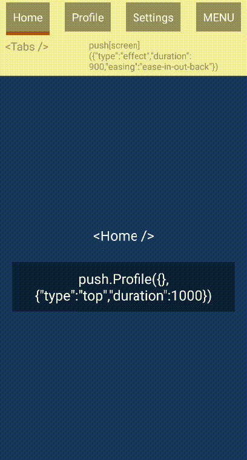

# easyrouter
Test React Native app for https://github.com/sergeyshpadyrev/react-native-easy-router/

## With Expo

1. Clone repo
2. `yarn`
3. `yarn start`

## Without Expo

1. Clone repo
2. `git checkout noexpo`
3. `yarn`
4. `react-native run-android` / `react-native run-ios`

